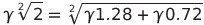

# Irrational Numbers Debunked
irrational numbers doesn't really exist outside Math imaginary world .. period.  

#### Let's get started with an easy one ..  

which in one n a half sentence, reduces to..    
  the point IS NOT that there's no ratio which exactly represent it ..  
   is just a quadratic one !!  
  
( why would ever a not silly person,  
  find a linear ratio in a quadratic dimension ¿? )  

see Fermat generalization .. https://github.com/cloned2k16/Fermat
